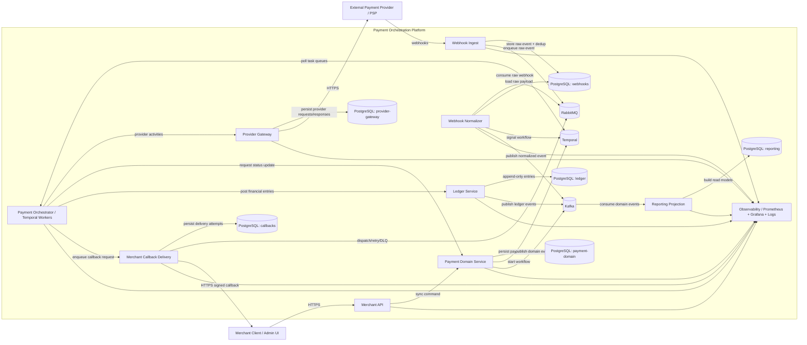
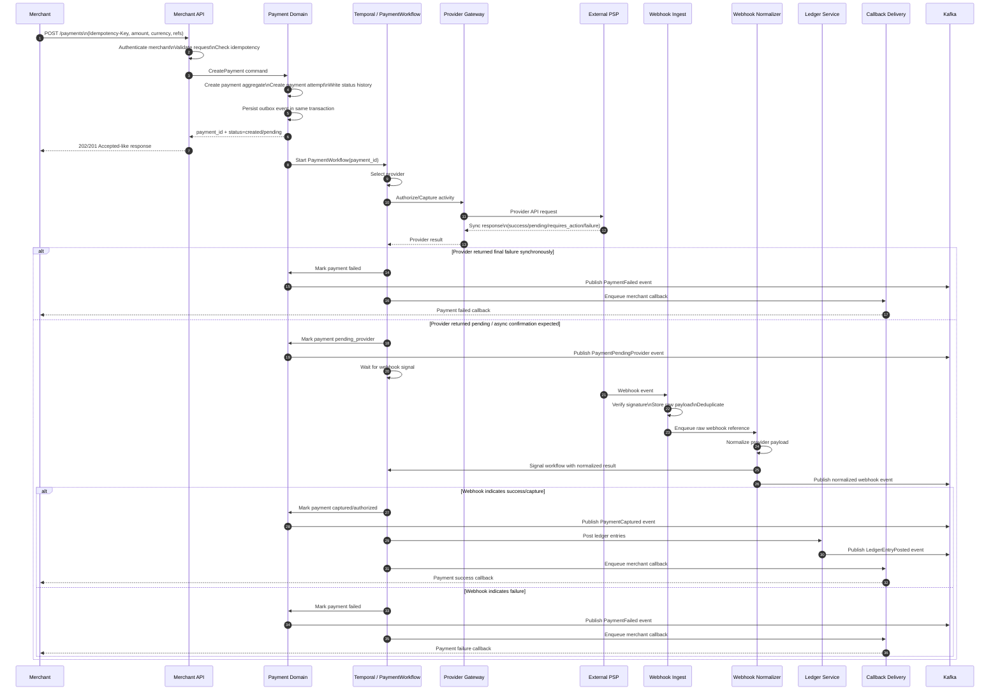
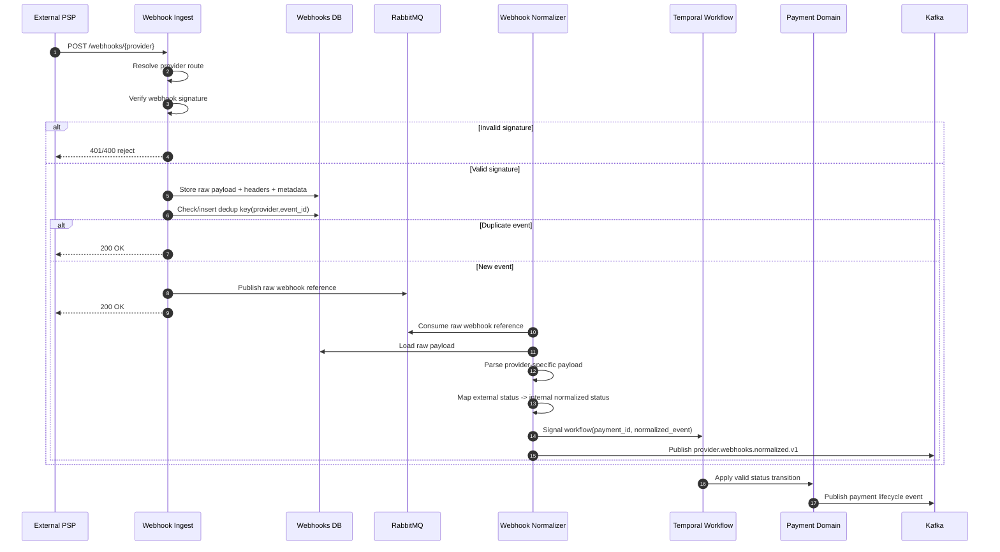
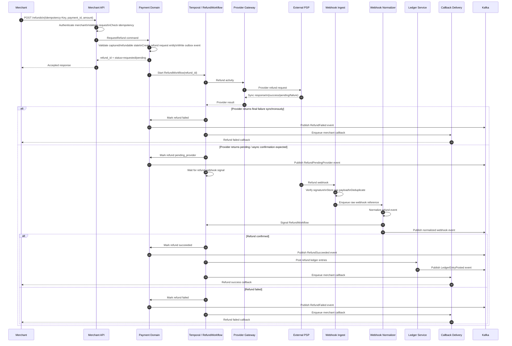

# Payment Orchestration Platform — C4 and Sequence Diagrams

This document contains the initial architecture diagrams for the payment orchestration platform.

## 1. [C4 — Container Diagram](./C4.png)

### Container responsibilities

#### Merchant API

Public HTTP interface for merchants.
Responsible for authentication, request validation, idempotency handling, rate limiting, and exposing payment/refund read operations.

#### Payment Domain Service

Owns authoritative payment lifecycle state.
Responsible for aggregates, state transitions, payment history, outbox, and business invariants.

#### Payment Orchestrator

Runs long-running workflows using Temporal.
Responsible for payment and refund orchestration, waiting for external confirmations, calling activities, and coordinating async flow.

#### Provider Gateway

Encapsulates provider integrations.
Responsible for request mapping, provider API calls, retry-aware activities, response mapping, and provider-side audit records.

#### Webhook Ingest

Fast ingress service for provider webhooks.
Responsible for signature verification, raw payload persistence, deduplication, and async enqueueing.

#### Webhook Normalizer

Converts provider-specific raw webhook payloads into internal normalized events/signals.
Responsible for status mapping and workflow signaling.

#### Ledger Service

Owns append-only financial records.
Responsible for idempotent ledger posting and financial audit trail.

#### Merchant Callback Delivery

Responsible for asynchronous merchant notifications, signed callbacks, retries, and DLQ handling.

#### Reporting Projection

Consumes Kafka domain events and builds read models for analytics, dashboards, and query-optimized projections.

---

## 2. [Sequence Diagram — Payment Flow](./payment-flow.png)

### Notes

* The public API returns a stable internal identifier and does not depend on final synchronous completion.
* Workflow state is durable in Temporal.
* Payment Domain remains the owner of payment lifecycle state.
* Ledger posting happens only after a financially meaningful outcome.

---

## 3. [Sequence Diagram — Webhook Flow](./webhook-flow.png)

### Notes

* Webhook HTTP handling is intentionally thin and fast.
* Raw payload is stored before downstream processing.
* Deduplication is applied at ingest and should be reinforced downstream with inbox/processed message tracking.
* Normalization is separated from ingress to keep the hot path simple and scalable.

---

## 4. [Sequence Diagram — Refund Flow](./refund-flow.png)

### Notes

* Refund is modeled as its own workflow rather than a side effect hidden inside the payment flow.
* Refund eligibility is validated by the Payment Domain service before the workflow starts.
* Ledger receives a separate financial posting flow for refund operations.

---

## 5. Suggested follow-up diagrams

The following diagrams can be added later:

* deployment diagram (Docker Compose / Kubernetes)
* provider routing decision flow
* outbox publishing flow
* merchant callback retry/DLQ flow
* ledger posting model
* observability / tracing flow
* failure scenarios (duplicate webhook, out-of-order status, retry avalanche)

---

## 6. Modeling conventions

The diagrams follow these architectural rules:

* Payment Domain owns authoritative payment state.
* Ledger Service owns financial truth.
* Webhook Ingest is separated from Webhook Normalizer.
* RabbitMQ is used for operational async work.
* Kafka is used for domain event streaming.
* Temporal is used for long-running orchestration.
* Service data is owned locally and never joined across services directly.
